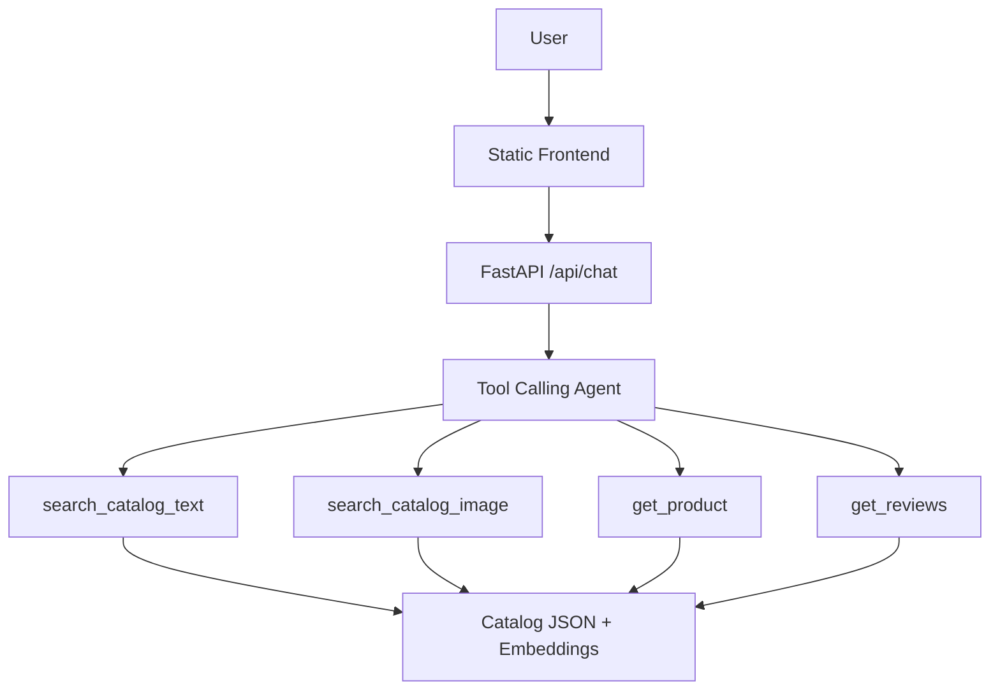

# Commerce Agent

An AI-powered commerce assistant for a predefined athletic apparel catalog. The app supports:

- General chat about capabilities and shopping help
- Text-based product recommendation and search
- Image-based product search using GPT vision plus semantic retrieval

The backend is FastAPI, the frontend is plain HTML/CSS/JS, and product grounding happens through tool calls against a local catalog file.

## Why this design

- The assignment requires recommendations to stay within a predefined catalog, so the agent never invents products from its own world knowledge.
- The Raspberry Pi target makes local CLIP and sentence-transformers less attractive, so this version uses OpenAI embeddings for lightweight deployment on ARM64.
- The frontend stays build-free so the whole app can ship as a single Python container without Node.js on the host.

## Architecture



## Project layout

```text
app/          FastAPI app, agent orchestration, retrieval logic
data/         Predefined catalog JSON and optional embeddings .npy
static/       Vanilla frontend and placeholder images
scripts/      One-time precompute script for catalog embeddings
evals/        Lightweight evaluation prompts and checker
k8s/          Deployment and service manifests for k3s
```

## Catalog retrieval flow

### Text search

1. The user sends a natural language query like `"breathable running tops under $40"`.
2. The agent decides whether to call `search_catalog_text`.
3. The backend embeds the query with `text-embedding-3-small`.
4. The app compares that vector against precomputed catalog vectors using cosine similarity.
5. Structured filters such as `max_price`, `activity`, or `color` are applied server-side.
6. Only the returned catalog products are shown in the response UI.

### Image search

1. The frontend sends a base64 image with the user message.
2. GPT vision converts the image into a concise product description.
3. That description is embedded as text and searched against the same catalog vectors.
4. The agent explains the matches, but only from tool results.

## Product schema

Each product in `data/catalog.json` includes:

- `id`, `name`, `brand`, `price`
- `category`, `subcategory`
- `description`
- `gender`, `activity`, `fit`, `material`, `color`, `season`, `tags`
- `image_path`
- `reviews`

This gives the retrieval layer enough semantic detail to explain *why* a product matched, not just that it matched.

## Getting started

### Prerequisites

- Python 3.11+ (tested on 3.13)
- An [OpenAI API key](https://platform.openai.com/api-keys)

### Option A: Run locally (Python)

```bash
git clone https://github.com/YOUR_USER/commerce-agent.git
cd commerce-agent

python3 -m venv .venv
source .venv/bin/activate
pip install -r requirements.txt

cp .env.example .env
# Edit .env and set OPENAI_API_KEY=sk-...

make embed   # precompute catalog embeddings (a precomputed file is included)
make run     # starts uvicorn on http://localhost:8000
```

Open [http://localhost:8000](http://localhost:8000).

### Option B: Run with Docker

```bash
cp .env.example .env
# Edit .env and set OPENAI_API_KEY=sk-...

make docker
docker run --rm -p 8000:8000 --env-file .env commerce-agent:latest
```

Open [http://localhost:8000](http://localhost:8000).

### Option C: Deploy to Kubernetes (k3s / k8s)

The manifests in `k8s/` use standard Kubernetes APIs and work on k3s, k8s, minikube, etc.

```bash
# 1. Build and import the image (k3s example)
make docker
docker save commerce-agent:latest -o /tmp/commerce-agent.tar
sudo k3s ctr images import /tmp/commerce-agent.tar

# 2. Create the secret
kubectl create secret generic commerce-agent-secrets \
  --from-literal=OPENAI_API_KEY='sk-...'

# 3. Deploy
make deploy
# (runs kubectl apply on deployment, service, and ingress)

# 4. Verify
kubectl get pods -l app=commerce-agent
kubectl port-forward service/commerce-agent 8012:80
```

Then open [http://localhost:8012](http://localhost:8012).

The ingress uses `commerce-agent.local` as a placeholder host. Replace it in `k8s/ingress.yaml` with your actual hostname if you have Traefik or nginx-ingress set up.

> **Note on k3s vs k8s**: The only k3s-specific step is the `ctr images import` (because k3s uses containerd). On standard k8s or minikube, you'd push to a container registry instead. The manifests themselves are identical across all conformant clusters.

## API

### `POST /api/chat`

Request:

```json
{
  "message": "recommend trail shoes with grip under $120",
  "image_b64": null,
  "conversation_id": "optional-uuid"
}
```

Response:

```json
{
  "reply": "Here are a few good trail-ready options...",
  "conversation_id": "uuid",
  "products": [],
  "sources": [],
  "metadata": {}
}
```

### `GET /api/products/{product_id}`

Returns one product from the predefined catalog.

### `GET /api/health`

Health endpoint for local checks and Kubernetes probes.

## Evaluation

Run the local eval harness after the app is up:

```bash
make eval
```

The eval script checks:

- response status
- whether returned product IDs exist in the catalog
- whether product-returning prompts actually return products

## Notes on local models

This implementation intentionally does **not** run CLIP or sentence-transformers locally. If deployed on a more capable machine, an alternate image retrieval path could:

- embed catalog product images with CLIP offline
- embed uploaded query images at runtime
- compare image vectors directly instead of going through a vision-generated text description

The current approach (GPT vision to text description, then text embedding) lets both text and image queries share the same embedding space with no extra infrastructure.
